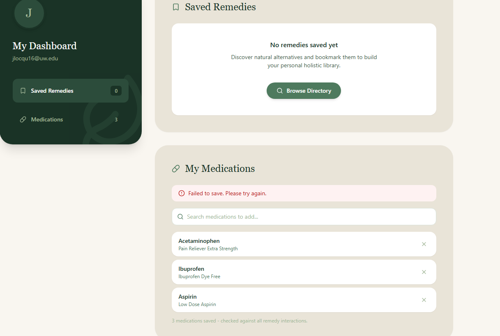

*Bugs to fix*
- Some pages are slightly off due to some pages not having any scrollbar on the side. Every page should have a custom hidden scrollbar.
- When adding medications, it says "Failed to save. Please try again." Then they stay saved on the page, until you click off onto another page, then the saved medications disappear.

*TODO List*
- Add Redis to cache popular queries and search results
- Implement an event/message bus like RabbitMQ or ActiveMQ to move data ingestion out of the request lifecycle
- Remove search algorithm/engine and replace with Elasticsearch
- Check whether lint fails because some tests are designed to fail in order to pass
- Add filters to sort by:
    - Tier
- When a symptom is searched and there are no results, suggest that the symptom they are looking up may be more than a natural herb/remedy can handle, and that they should consult their doctor

*Feedback to implement*
- Add "Consult your doctor" disclaimer on results page as a pop-up modal when they load up the website
    - Before you explore Holistic Health
    
    Holistic Health provides general, educational information about natural remedies. It is not medical advice, and it is not a substitute for diagnosis, treatment, or guidance from a licensed physician, pharmacist, or other qualified healthcare provider.

    Natural compounds can still interact with medications, existing conditions, and each other. Always consult your doctor or pharmacist before starting, stopping, or combining any remedy - especially if you are pregnant, nursing, managing a chronic condition, or taking prescription medication.

    Holistic Health and its developers assume no liability for outcomes resulting from use of information on this platform. Use of this site is at your own discretion and risk.

    I understand
- Add a key/legend explaining what the different tiers mean on results page and remedy details page
- Add photos of what remedies look like

